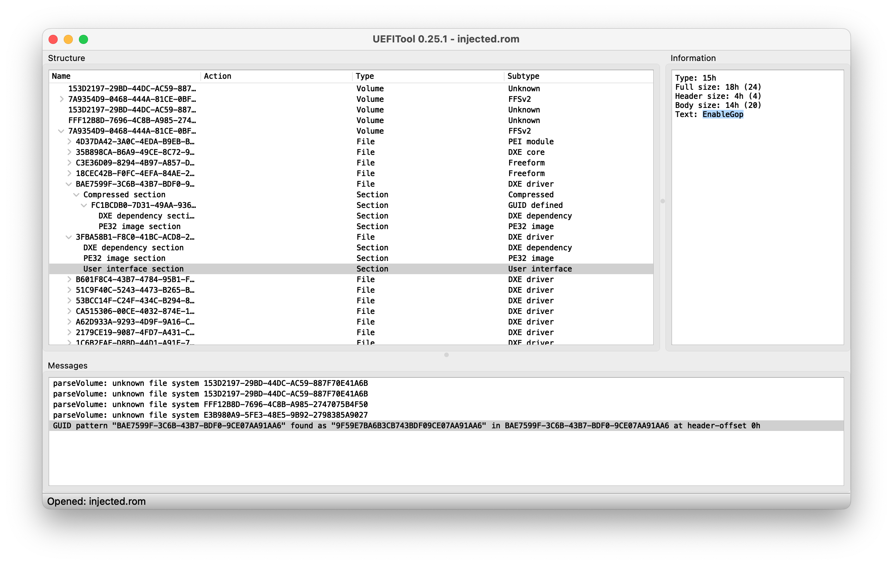

# Provides standalone GOP driver for EFI era Mac Pro and iMac

## Releases

EnableGop version (OpenCore version)

### 1.4 (0.9.3)
 - Incorporates recent updates to OpenCore console control code, but no difference in behaviour compared
   to version 1.3 is expected on any supported systems.

### 1.3 (0.9.2)
 - Included fix to GopBurstMode for non-standard frame buffer information on AMD Radeon HD 7970 and similar
 - Applied GopBurstMode even on natively supported cards, as it can provide a noticable speed up

### 1.2 (0.9.1)
 - Added GopBurstMode support

*Note 1*: This should provide faster GOP rendering on all EnableGopDirect systems; and rendering at least at
the same speed as before, and on some systems noticeably faster than before, on almost all EnableGop systems.

*Note 2*: The compressed driver for version 1.2 is 1KB larger than for version 1.1, so for AMD GPU firmware which is
tight on space version 1.1 may be used instead to avoid the need for VGA stripping to make additional space.

### 1.1 (0.9.0)
 - Fixed early verbose boot lines appearing over picker
 - Added EnableGop version number to UI section

### 1.0 (0.8.9)
 - Initial public release

## Status
**Current status: Beta release.**

This driver has been tested and is working on several iMac models
with several different GPUs, and on several MacPro4,1/5,1 machines with several different GPUs. However, in the worst
case (and still possible) scenario, an incompatible or incorrectly installed driver
in firmware may brick your hardware.

*In all cases take a backup of the main firmware or GPU firmware which you are modifying, and confirm that
you can successfully restore from this, before starting.*

## Recovery from bricked hardware
 - If attempting main firmware insertion on a MacPro4,1/5,1, for recovery from a bricked device you will either
need a Matt card (which may breach intellectual property laws in some jurisdictions) or the ability to
desolder and reprogram your own SPI flash chip.
 - If testing via main firmware insertion on an iMac, you will need the ability to disassemble your iMac and
reprogram its SPI flash chip using a SOIC clip attached to a CH341A controller running on another computer.
 - If testing via GPU firmware insertion (iMac or Mac Pro), you will need the ability to disassemble your system,
likely remove the heat sink from the graphics card, and then reprogram its SPI flash chip using a SOIC
clip attached to a CH341A controller running on another computer.
   - If testing via GPU firmware insertion, in some cases it may also be possible
to use physical electrical connection to your GPU in order to enable booting with no graphics even though the GPU
is present, then connect to your machine with `ssh` (which must have been enabled beforehand) and reprogram the GPU
firmware. Advice on this headless boot approach is not provided here, but may be found for instance on the iMac GPU
related forum threads listed below.

*If you are not familiar with the above procedures, you are strongly recommended to wait for further testing by
users who are. No further help can be provided here, and you proceed entirely at your own risk.*

## Summary
Targetting EFI-era (~2009-2012) MacPro4,1/5,1 and iMac firmware, this driver gathers and injects the parts of
OpenCore needed for pre-boot graphics support with non-natively supported GPUs.

The requirements for using this driver are:

 - EFI-era (~2009-2012) MacPro4,1/5,1 or iMac with most recent main firmware.
 - A GPU which does not produce native pre-boot graphics (such as native picker when pressing ALT key during boot)
 before OpenCore starts (otherwise, you do not need it).
 - A GPU which produces graphics when using OpenCore (this must include successfully showing the native Apple boot
 picker when started via the latest version of OpenCore tool `BootKicker.efi`) (otherwise, the driver will not work).
   - *Note*: If your OpenCore installation includes a required GOP driver for your graphics card, then you would
   also need to burn that driver to the firmware of your graphics card in order to obtain pre-OpenCore graphics;
   instructions for this are outside the scope of this tutorial, although the procedures required for modifying
   GPU firmware are similar to what is covered here.
   Note that such a driver is added by the OCLP **Enable AMD GOP** option, which is enabled automatically on some
   systems by recent versions of OpenCore Legacy Patcher, as a way to enable the OpenCore menu in cards such as ex-mining GPUs.

When installed, the driver should enable:

 - Native boot picker via ALT key
 - Firmware password UI
 - Target disk mode UI
 - macOS boot progress screen
 - etc.

Compiled versions of the driver files and these instructions may be found in the `Utilities/EnableGop`
directory of the OpenCore release package.

For GPUs needing `DirectGopRendering` in OpenCore configuration, use `EnableGopDirect.efi`, otherwise use `EnableGop.efi`
as it renders faster on most other systems.

The driver may be installed to GPU or main motherboard firmware. It is expected that most Mac Pro users will use main firmware insertion
and most iMac users will chose GPU firmware insertion, however both techniques work on both systems (but it is harder to modify the
iMac main firmware, since there is no simple way to enable writing to it).

Further discussion and community support for this driver is available at:

 - https://forums.macrumors.com/threads/pre-opencore-gop-support-for-efi-era-imacs-and-mac-pros.2378942/

## Usage

## Install to main firmware

For reading and writing to main firmware on the Mac Pro, @Macschrauber's [Rom Dump](https://github.com/Macschrauber/Macschrauber-s-Rom-Dump) works
well. Alternatively the kexts and executables which this uses can be sourced individually (or extracted from the Rom Dump app) and
run from the command line.

The main firmware on the iMac cannot be updated without an initial hardware flash (SOIC clip plus CH341A controller), therefore
the recommended approach on iMac systems is [GPU firmware injection](#install-to-gpu-firmware). However, the below instructions for firmware
injection do work, if you are willing to do a hardware flash of the resulting firmware file, or if you have already
[unprotected your iMac firmware](https://forums.macrumors.com/threads/imac-2011-see-more-uefi-firmware-mod.2257435/page-3?post=31087001#post-31087001) -
which reduces security, and is only recommended for those actively developing firmware modifications.

The `.ffs` file provided in this directory can be manually added to the extracted firmware file using [`UEFITool`](https://github.com/LongSoft/UEFITool),
or automatically added using @dosdude1's [`DXEInject`](https://dosdude1.com/apps/). Once more, if you are not familiar with these procedures,
you are recommended to proceed with extreme caution.

### Using DXEInject

To install the driver via `DXEInject`, the command is:

 - `DXEInject {original}.rom {modified}.rom EnableGop.ffs`

The file `{modifed}.rom` is ready for burning, although the result can be checked using UEFITool, if required.

> *Note*: If only reading a file with UEFITool, the latest version is recommended, as it provides the most information.
For writing, the older version 0.25.1 must be used, as described below.

### Using UEFITool

The `.ffs` file may be inserted anywhere within the same firmware volume which contains `DuetBds`
(file GUID `A6F691AC-31C8-4444-854C-E2C1A6950F92`). However, for simplicity, these instructions
will insert it in the same place that `DXEInject` does:

 - Use UEFITool 0.25.1 (it must be that old version, not the newer NE or new engine versions, which
cannot yet edit)
 - Perform a header-only GUID search for `BAE7599F-3C6B-43B7-BDF0-9CE07AA91AA6`
 - Double-click on the search result
 - Right-click on the DXE driver with that GUID which should then appear
 - Choose "Insert after..." and select `EnableGop.ffs`
 - Save the modified firmware

The end result, after saving and re-loading, should look like this:

## Install to GPU firmware

Instructions and a script for inserting the driver into Nvidia or AMD GPU firmware (aka VBIOS) are provided.

Please note all the cautions already given above about the difficulty of recovering, unless you are familiar with
the procedures necessary, if this process fails.

To use the provided `vBiosInsert.sh` script:

 - Locate an appropriate version of the `nvflash` tool (Nvidia) or `amdvbflash` tool (AMD) (both are available for
   Linux and Windows), which can be used to read from and write to the GPU firmware.
 - Use that tool to read a copy of the GPU firmware.
 - Run `./vBiosInsert.sh [-a|-n] {original}.rom EnableGop.efi {modified}.rom`, with `-a` for AMD and `-n` for Nvidia.
    - If you have any problems with `vBiosInsert.sh` from a specific release
    of EnableGop, please try the version included with the latest release of OpenCore
    before reporting any issues.
    The script receives updates to support additional graphics cards independently
    of any bumps to the release version of EnableGop. If you need to, you can use
    the latest version of `vBiosInsert.sh` to inject older versions of EnableGop.
 - The new file `{modified}.rom` may be burnt to the GPU firmware.

In the case of AMD, considerably less space is normally available, due to a strict limit of 128k for legacy and EFI 
parts of the larger ROM image. If there is not enough space (i.e. script reports
data would be truncated) then it is necessary to [strip some legacy VGA parts of the
GPU firmware](https://github.com/Ausdauersportler/IMAC-EFI-BOOT-SCREEN/wiki/Deleting-the-VGA). This is beyond the scope
of these instructions.

If required to manually detect the GOP offset (this should normally be autodetected):

> Using a hex editor, search in the GPU firmware dump for the byte sequence `F1 0E 00 00` with the byte sequence `55 AA` coming
 close before it; the start address of the `55 AA` is the GOP offset value needed.

For further information on GPU firmware modification, see:

 - https://forums.macrumors.com/threads/2011-imac-graphics-card-upgrade.1596614/
 - https://forums.macrumors.com/threads/imac-2011-maxwell-and-pascal-gpu-upgrade.2300989/
 - https://github.com/Ausdauersportler/IMAC-EFI-BOOT-SCREEN/wiki
 - https://winraid.level1techs.com/t/amd-and-nvidia-gop-update-no-requests-diy/30917
